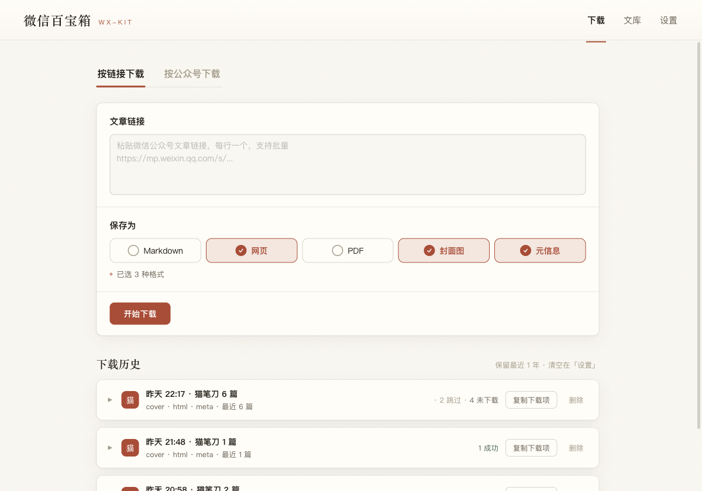
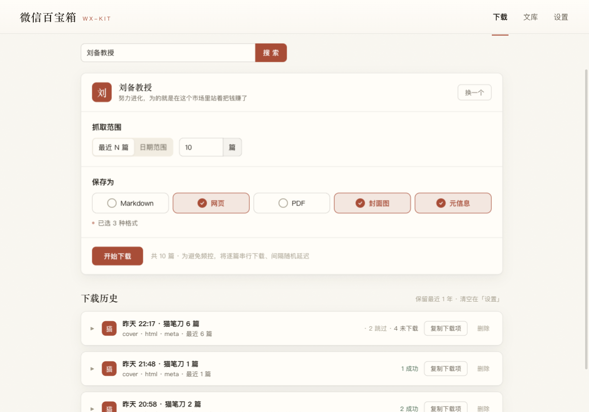
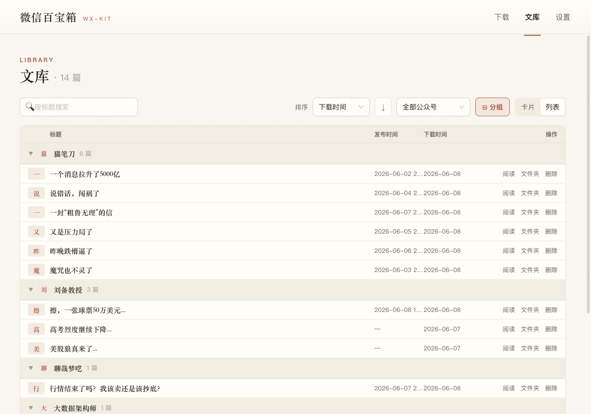
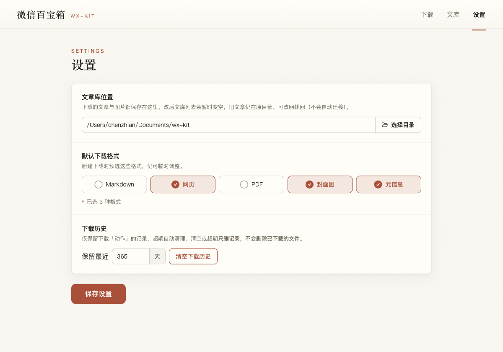

# wx-kit · 微信百宝箱

> 把微信公众号文章下载为多种格式并在应用内浏览；支持按公众号批量爬取；
> 同一二进制带 CLI，可被 AI agent 直接调用。单进程 Electron，GUI 与 CLI 双启动模式。


-ready-success.svg)

<!-- 截图：v0.2.0（真实数据态） -->
| 下载 · 按链接 | 下载 · 按公众号 | 文库 · 分组卡片 | 文库 · 列表 | 设置 |
| :---: | :---: | :---: | :---: | :---: |
|  |  |  |  |  |

## 这是什么

微信百宝箱是一个**桌面工具**:

- **下载**任意微信文章为封面 / Markdown / 网页 / PDF / 元信息 5 种格式;
- **批量爬取**某个公众号的历史文章(按数量或日期范围);
- **库内阅读**已下载文章;
- **同二进制**带 CLI(`npx electron . download ...`),面向 AI agent 自动化调用。

**第一阶段**聚焦在下载/爬取/阅读/CLI 这条主线,后续会扩展为更通用的「百宝箱」。

## 特性

- 🖥 **GUI + CLI 双启动** —— 同一份 Electron 二进制,带子命令即进 CLI,否则开窗口。
- 📦 **多格式导出** —— 封面、Markdown、HTML、PDF、元信息,可任意组合。
- 🔁 **断点续传 + 去重** —— 每篇落盘即写索引,中断/重跑自动跳过。
- 🛡 **节流 + 退避** —— 批量爬取默认串行 + 随机延迟,命中频控自动退避,不裸报错。
- 💻 **单进程单语言** —— 纯 Node + Electron 31,无 Python 边车、无独立 chromium、无数据库(文件系统 + JSON 索引)。
- 🤖 **Agent 友好** —— 同一 CLI 输出纯 JSON,`stdout` 走数据、`stderr` 走进度、退出码 `0/1/2`。

## 30 秒上手(CLI)

```bash
# 1. 装依赖
npm install

# 2. 跑 GUI(开发模式)
npm run dev

# 3. 跑 CLI 试一下
npx electron . download --url "https://mp.weixin.qq.com/s/xxx" --formats md,html,meta
```

输出在 `~/Documents/wx-kit/`(可在设置改)。

## 30 秒上手(下载安装包)

去 [Releases](../../releases) 选 `wx-kit-0.1.0-arm64.dmg`(Apple Silicon) /
`wx-kit-0.1.0.dmg`(Intel) / `wx-kit Setup 0.1.0.exe`(Windows)。当前**未签名**,首次打开需手动放行:

- **macOS** —— 右键应用 →「打开」→ 再次「打开」;或 `xattr -cr /Applications/wx-kit.app`。
- **Windows** —— SmartScreen →「更多信息」→「仍要运行」。

## 架构(一分钟)

```
┌─────────────────────────────────────────────┐
│  Electron (单进程)                          │
│  ┌────────────┐  ┌──────────────────────┐    │
│  │  Renderer  │◄─┤  IPC (preload 桥)    │    │
│  │  React UI  │  │  main process        │    │
│  └────────────┘  │  services/*          │    │
│                  │  ipc / wxfile proto  │    │
│                  └─────────┬────────────┘    │
│                            │                 │
│   同一二进制带 CLI ────────┤                 │
│  ┌────────────┐  ┌─────────▼────────────┐    │
│  │  CLI       │──│  src/core/ (纯逻辑)  │    │
│  │  commander │  │  - parse / export    │    │
│  └────────────┘  │  - library / queue   │    │
│                  │  - mp-auth / crawl   │    │
│                  └──────────────────────┘    │
└─────────────────────────────────────────────┘
```

- **`src/core/`** —— UI 无关纯逻辑,被 GUI 与 CLI 共享。**绝不** import electron/renderer。
- **`electron/`** —— 主进程,IPC 处理器做薄委派,`mp-*` 服务对接微信后台。
- **`src/cli/`** —— 同二进制,`src/renderer/` 缺失时即 CLI 模式(详见 [`AGENTS.md`](AGENTS.md))。

完整需求见 [`docs/PRD.md`](docs/PRD.md);当前进度见 [`ROADMAP.md`](ROADMAP.md);开发指南(决策/不变量/陷阱)见 [`AGENTS.md`](AGENTS.md)。

## 命令速查

| 场景 | 命令 |
|---|---|
| 开发(GUI 热更) | `npm run dev` |
| 类型检查 | `npm run typecheck` |
| 单测 | `npm test` |
| 单测(监听) | `npm run test:watch` |
| Lint | `npm run lint` |
| GUI 端到端(Playwright) | `npm run test:e2e` |
| 出 mac 安装包 | `npm run package:mac` |
| 出 win 安装包 | `npm run package:win` |
| 一次性出 mac+win | `npm run package` |
| 进入 CLI 模式 | `npx electron . <子命令>` |

### CLI 子命令

```bash
npx electron . download --url <u> [--formats md,html,pdf,meta] [--out <dir>]
npx electron . login                                   # 扫码登录公众号后台
npx electron . auth-status                             # 查登录态(真探测)
npx electron . search <公众号名>                        # 搜号,返候选
npx electron . crawl <公众号名> --count 2              # 批量爬取
npx electron . library list                            # 列已下文章
```

退出码:`0` 成功、`1` 业务失败、`2` 用法或鉴权错误。详见 [`docs/PRD.md` §F4](docs/PRD.md)。

## 项目状态

**第一阶段(URL 下载 + 批量爬取 + 库内阅读 + 分发)已交付**,各里程碑均合入 main,端到端在真实微信公众号后台验证通过:

- ✅ M1 — 核心层 + CLI `download` 五格式
- ✅ M2 — GUI:下载页 / 书架 / 阅读器 / 设置
- ✅ M3 — 扫码登录 + 批量爬取(CLI)
- ✅ M3.5 — 批量爬取 GUI 页(单页渐进:登录引导 → 搜号 → 实时逐篇)
- ✅ M4 — electron-builder 打包:未签名 mac(dmg arm64+x64)+ win(nsis x64)

详见 [`ROADMAP.md`](ROADMAP.md) 与 [`docs/devlog/wx-kit-vibe-coding.md`](docs/devlog/wx-kit-vibe-coding.md)(逐里程碑的决策/踩坑/方法论)。

## 贡献

欢迎 PR!具体流程见 [`CONTRIBUTING.md`](CONTRIBUTING.md) ——
跑 `npm test` / `npm run typecheck` / `npm run lint` 全部通过再提。
行为准则见 [`CODE_OF_CONDUCT.md`](CODE_OF_CONDUCT.md)。

安全漏洞请**不要**公开提 issue,按 [`SECURITY.md`](SECURITY.md) 私下报告。

## 许可证

[Apache License 2.0](LICENSE) — 见文件正文。`Copyright 2026 monkeychen`。

## 致谢

- 设计脱胎于技术探索原型 `../trae/x-downloader`,感谢那段 PyQt 时代留下的判断。
- 用了 [`playwright`](https://playwright.dev) 做 e2e 与图标渲染、`electron-builder`](https://www.electron.build) 出安装包。
