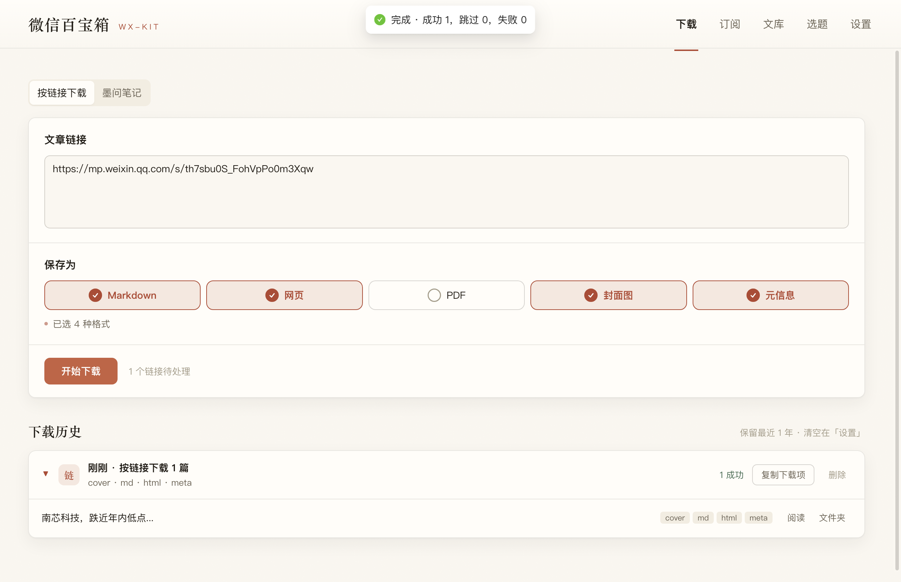
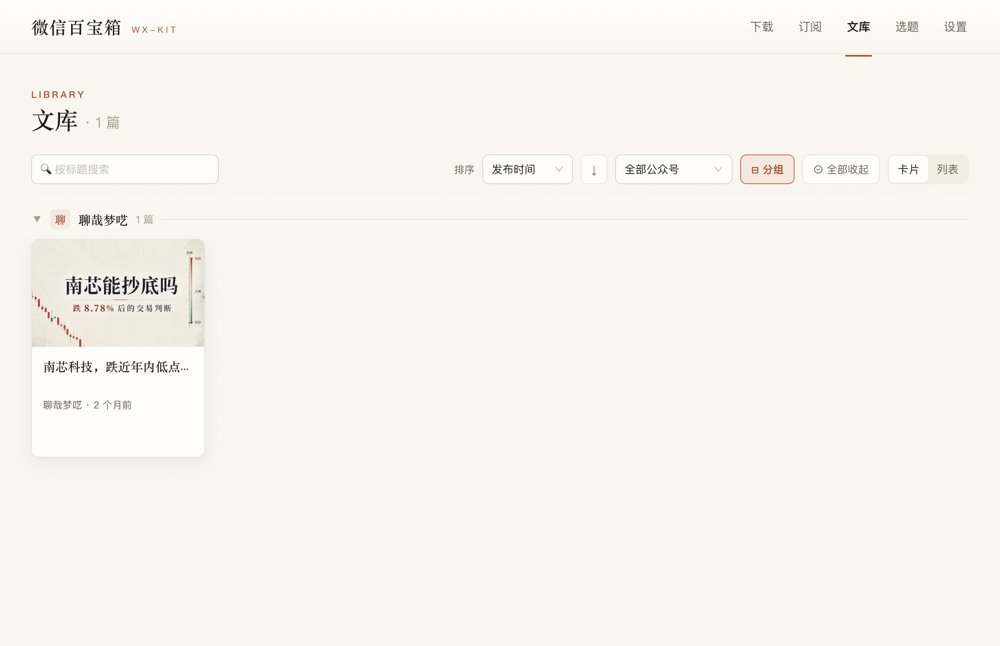
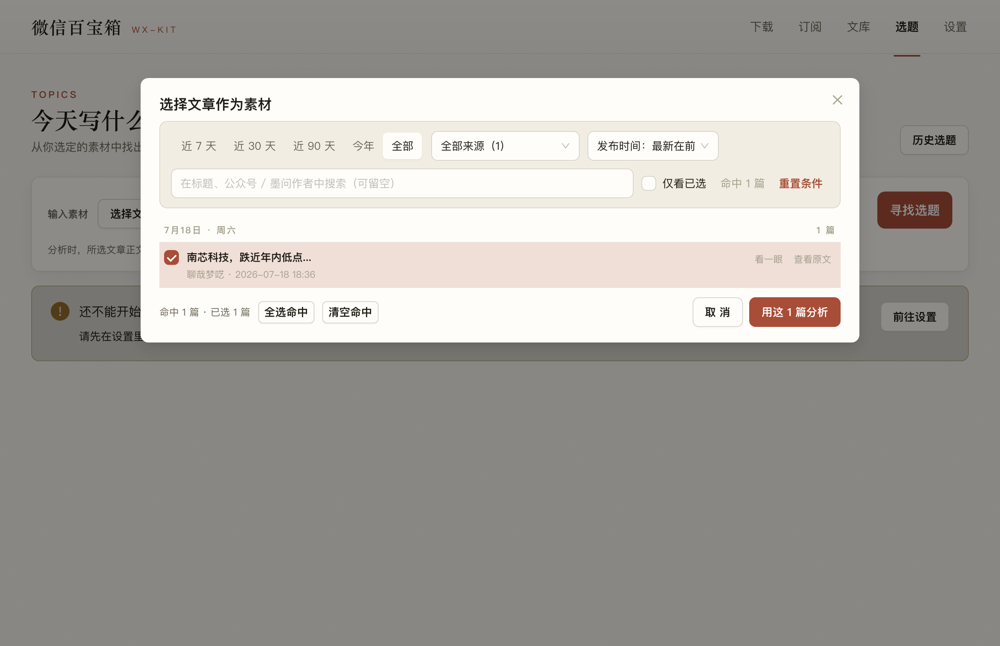
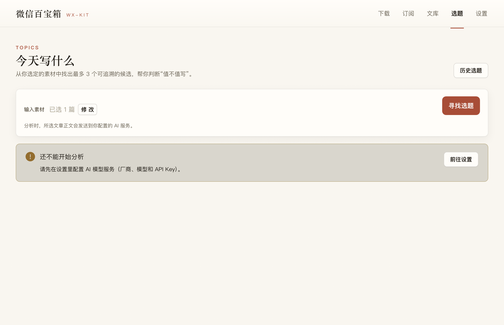
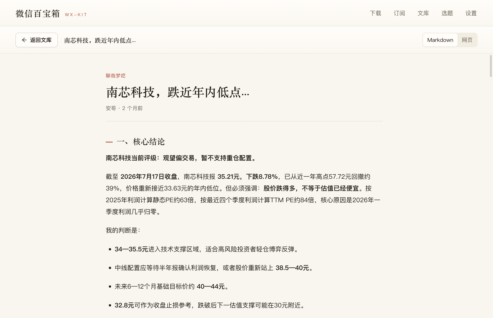
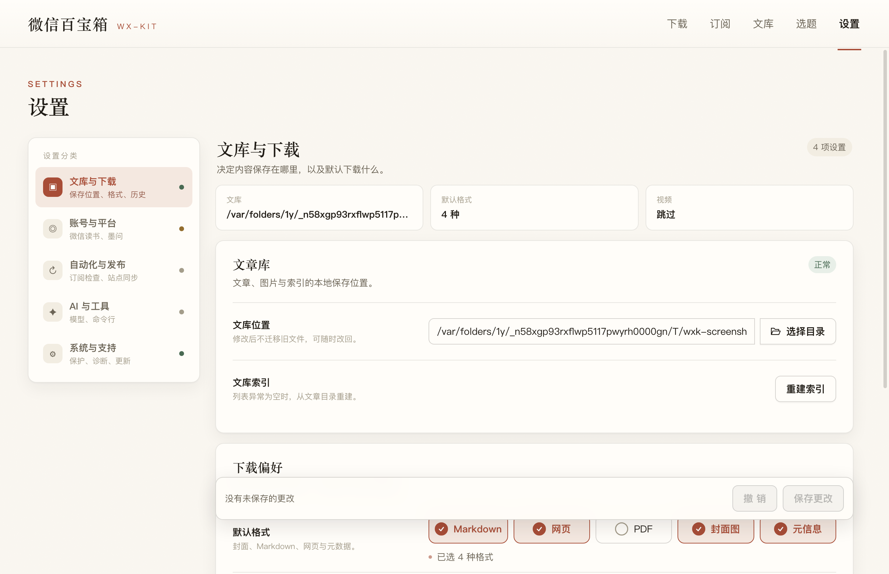

# wx-kit · 微信百宝箱

> 下载微信公众号文章，保存为可阅读、可检索、可继续创作的本地资料；同一应用同时提供 GUI 与纯 JSON CLI。


## 这是什么

wx-kit 是一个本地优先的微信公众号文章下载器：

- 粘贴一个或多个文章链接，下载为 Markdown、HTML、PDF、封面和元信息；
- 自动保存正文图片，默认同时下载文章内视频；
- 在本地文库中阅读、搜索、分组、删除和导出素材；
- 可把文库文章同步为 Astro 站点内容；
- GUI 适合日常使用，CLI 输出纯 JSON，适合 AI agent 和脚本调用。

> **当前能力边界（v0.12.0）**
>
> v0.12.0 新增**选题工作台**——把本地素材变成可解释的「今天写什么」：选文章 → 得到最多
> 三张写明理由、材料依据与起笔结构的候选卡，每条判断可回溯、失败不伪装；同时在
> 「设置 → AI 模型」接入多厂商模型（BYOK）：
>
> - **选题 GUI**：输入素材（从文库勾选，筛选为主搜索为辅）→ 分析 → 三候选平等展示，
>   反馈与 Markdown 简报；历史选题可回看、可删除；分析过程 SSE 流式实时可见、可取消；
> - **选题 CLI**：`wx-kit topics analyze --range 24h|3d|7d|custom | --article <id...>`
>   与 `wx-kit topics brief`，stdout 纯 JSON 供 agent 消费（时间窗口选材仅 CLI 保留）；
> - **多厂商 AI 设置**：智谱/千问/DeepSeek/Kimi/MiniMax/OpenAI/Google + 自定义，
>   Key 经系统加密落盘、绝不进日志；正文出机边界明示；
> - **Windows 正式支持**：修复 Windows 下阅读器图片/封面全挂的本地协议路径 bug；
> - **墨问能力（v0.11.x 延续）**：下载页「墨问笔记」tab（搜作者/关键词/按链接）；
>   订阅页墨问作者订阅；阅读器内联引用卡片；统一诊断日志 `main.log`（脱敏、滚动）；
> - **降级项（微信侧，与 v0.10.6 一致）**：微信读书列表接口仍被服务端按账号限制，
>   订阅每次仅返回该号最新一篇；「按公众号批量下载」入口保持移除。

## 当前界面

以下截图来自 v0.12.0 界面（选题页与设置页为 v0.12.0 形态；下载页双 tab、订阅页
平台切换、文库、阅读器延续 v0.11.x）。

| URL 下载与历史 | 本地文库 |
|---|---|
|  |  |

| 选题：从文库选素材 | 选题：已选素材待分析 |
|---|---|
|  |  |

| Markdown 阅读器 | 有效设置 |
|---|---|
|  |  |

## 快速开始

### 开发运行

```bash
npm install
npm run dev

# CLI 下载一篇或多篇文章
npx electron . download \
  --url "https://mp.weixin.qq.com/s/XXX" \
  --formats md,html,meta
```

默认文库位于 `~/Documents/wx-kit/`，可在设置页修改。

### macOS：Homebrew

```bash
brew install --cask monkeychen/wx-kit/wx-kit
xattr -cr /Applications/wx-kit.app
```

未签名应用带 quarantine 时，Gatekeeper 可能连 CLI 一并拦截，因此安装后需要执行 `xattr -cr`。升级前先刷新本地配方：

```bash
brew update && brew upgrade --cask wx-kit
xattr -cr /Applications/wx-kit.app
```

### macOS / Linux：npm

```bash
# 国内网络可先指定 Electron 镜像
export ELECTRON_MIRROR=https://cdn.npmmirror.com/binaries/electron/
npm install -g @simiam/wx-kit
wx-kit --version
```

官方 npm `latest` 仍按渠道规约维护；包名带 scope，但安装后的命令仍是 `wx-kit`。

### 下载安装包

前往 [GitHub Releases](../../releases) 下载最新已发布版本 v0.12.0：

- Apple Silicon：`wx-kit-0.12.0-arm64.dmg`
- Intel Mac：`wx-kit-0.12.0.dmg`
- Windows：`wx-kit.Setup.0.12.0.exe`

当前安装包未签名、未公证。macOS 首次打开时需在“系统设置 → 隐私与安全性”中允许，或执行上面的 `xattr -cr`；Windows 遇到 SmartScreen 时选择“更多信息 → 仍要运行”。

## 当前可用 CLI

开发期在命令前使用 `npx electron .`；全局安装后直接使用 `wx-kit`。

| 目标 | 命令 |
|---|---|
| 下载文章 | `wx-kit download --url <URL> [--url <URL> ...] [--formats md,html,pdf,meta] [--out <目录>]` |
| 从文件批量下载 | `wx-kit download --urls-file <文件> [--no-video]` |
| 查看文库 | `wx-kit library list` |
| 搜索文库 | `wx-kit library search <关键词> [--account <公众号>]` |
| 导出创作素材 | `wx-kit library export --ids <id,id>` |
| 删除文章 | `wx-kit library remove --ids <id,id>` |
| 重建文库索引 | `wx-kit library rebuild` |
| 同步到 Astro 站点 | `wx-kit site sync ...` |
| 查看或修改有效设置 | `wx-kit settings get [键]` / `wx-kit settings set <键> <值>` |
| 检查更新 | `wx-kit update --check` |
| 查看版本或帮助 | `wx-kit --version` / `wx-kit --help` |

微信读书后端相关命令（v0.10.0 起复活）：

| 目标 | 命令 |
|---|---|
| 扫码登录微信读书 | `wx-kit login`（终端打印二维码） |
| 从文章链接识别公众号 | `wx-kit search --url <该号任意一篇文章链接>` |
| 检查订阅更新 | `wx-kit subscription check-now [--accounts a,b]` |
| 查自动下载了什么（M56） | `wx-kit subscription list`（输出 `recentLog` 含逐篇明细） |
| 按发表日期查本地订阅文章（M55） | `wx-kit subscription digest --date <日期>` |

墨问笔记相关命令（v0.11.0 起，需 [mocli](https://github.com/mowenxd/cli) 认证）：

| 目标 | 命令 |
|---|---|
| 下载笔记（单篇/按作者批量） | `wx-kit mowen import <note-id\|URL> [--expand-refs]` / `wx-kit mowen import --uid <uid>` |
| 搜索/订阅墨问作者 | `wx-kit mowen subscribe --keyword <名字>`（先看候选）→ 带 `--uid` 确认 |
| 检查墨问订阅更新 | `wx-kit mowen check-now [--uid <uid>]` |
| 查墨问订阅列表 | `wx-kit mowen list` |
| 搜用户/列清单/搜笔记 | `wx-kit mowen search-user / list-user / list-mine / search` |
| 刷新下载后查今天（M55） | `wx-kit subscription digest --date today --download` |
| 登录态迁移 | `wx-kit session export/import` |
| 请求保护 | `wx-kit protection status/pause/resume` |

CLI 契约：stdout 只输出 JSON，stderr 输出进度；退出码 `0` 表示成功，`1` 表示业务失败，`2` 表示用法错误或需先登录。完整参数和示例见 [`agent/wx-kit-skill/`](agent/wx-kit-skill/)。

digest 以 `library.json.publishTime` 按北京时间筛选，默认（包括 today）纯本地、无需登录。
仅今天允许显式 `--download`，会刷新最新 cover、下载缺失文章并重读文库，不受自动检查时间或自动下载设置影响；
非今天加该选项会在联网前返回 `DOWNLOAD_TODAY_ONLY`（退出码 2）。清单只代表本地保存内容，无法保证捕获
两次刷新间被 cover 覆盖的文章。无法确定发表时间时保留正文并告警，日报不将其归入任意日期，
通过 `unknownPublishTimeCount` 报告所选账号范围内的未知日期条目数；失败详情见 `failures`。

### 安装包内的 CLI

macOS 直接调用应用包内的可执行文件，不能使用 `open -a`，因为它不会可靠透传 stdout 和退出码：

```bash
/Applications/wx-kit.app/Contents/MacOS/wx-kit download \
  --url "https://mp.weixin.qq.com/s/XXX" \
  --formats md,meta \
  --out ~/Documents/wx-kit
```

Windows 默认路径：

```powershell
& "$env:LOCALAPPDATA\Programs\wx-kit\wx-kit.exe" download --url "..." --formats md,meta --out . > result.json 2> progress.log
```

Electron 在 Windows 是 GUI 子系统程序，stdout 不会回贴当前控制台；请重定向到文件，agent 集成优先使用 macOS 或 Linux。

## 功能说明

### 下载与保真

- 支持普通图文、文字消息、视频消息、图片消息等当前已适配的页面类型；
- 图片和视频会在解析文章的同一次流程中本地化，带时效签名的媒体 URL 不写入文库；
- `--no-video` 可以关闭视频下载，适合控制流量和磁盘占用；
- 未识别页面类型或媒体下载失败会写入 `warnings`，不会把可疑结果静默当成完全正常。

### 本地文库与素材供给

文库使用文件系统和 JSON 索引，不依赖数据库。`library export` 返回每篇文章的 `contentPath`，下游 agent 可以直接读取 Markdown 正文继续做分析或写作。GUI 也支持多选后“导出为素材”。

### 站点同步

`site sync` 会把文库文章生成到 Astro 站点的 `content/posts/<日期>-<slug>/` 中。目标目录已存在时不会覆盖，避免误伤已发布内容；wx-kit 只生成内容，不代替站点预览和发布。

## 架构

```text
Electron
├── Renderer：React GUI，只通过 preload 暴露的 API 调主进程
├── Main：IPC、CLI 分流、本地协议和 Electron 服务
├── CLI：Commander，stdout 为 JSON
└── Core：GUI 与 CLI 共用的解析、下载、文库和导出逻辑
```

- `electron/cli-dispatch.ts` 通过 `CLI_COMMANDS` 白名单判断是否进入 CLI；
- `src/core/` 不依赖 React 或 renderer；
- `src/renderer/` 不直接导入 core，只调用 `window.api`；
- 私有公众号后台实现目前保留在源码中，但产品入口与执行路径已停用。

## 开发验证

```bash
npm test
npm run lint
npm run typecheck
npm run test:e2e
npm run test:e2e:live-download
npm run build
```

本地 GUI e2e 覆盖当前有效界面与 fixture 下载闭环；`test:e2e:live-download` 使用隔离文库执行真实微信公众号文章 URL 的下载、历史、文库和阅读器验收。真实链路测试会访问微信，只在里程碑或发版验收时运行，不能用 fixture 结果代替。

## 项目状态

- 最新已发布版本：v0.12.0；GitHub Release 与 brew tap 已上线（npm `@simiam/wx-kit` 仍按可选渠道规约维护）；
- 下一版候选与完整发布史统一维护在 [`ROADMAP.md`](ROADMAP.md)，README 不再复制一份容易漂移的版本史。

需求、设计与开发约定分别见 [`docs/`](docs/)、[`ROADMAP.md`](ROADMAP.md) 和 [`AGENTS.md`](AGENTS.md)。

## 用户手册

想看「下载一篇文章该按哪个按钮、订阅怎么配、文库怎么用」——直接看
[`docs/USER_MANUAL.md`](docs/USER_MANUAL.md)（随版本同步更新，面向真人用户的
上手教程，含 GUI 截图与配套插画）。

命令行（CLI）面向 AI agent 的速查表在 `agent/wx-kit-skill/references/commands.md`，不在用户手册范围。

## License

[Apache-2.0](LICENSE)
