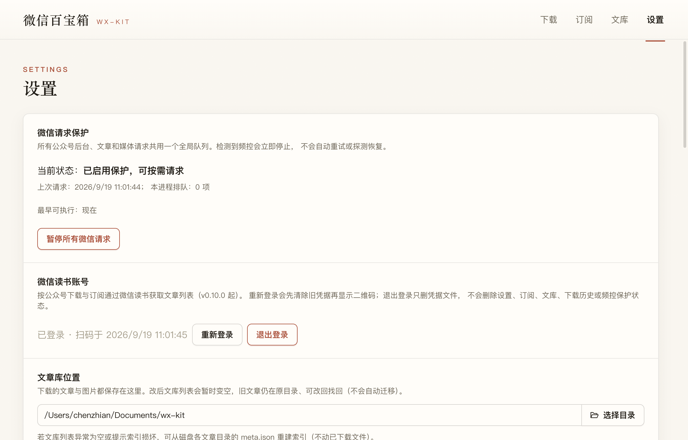

# wx-kit 用户手册（v0.11.3）

> 面向真实用户的上手指南。读完应该能完成：安装 → 下载 1 篇微信文章 → 在本地文库读它 → 订阅几个作者 → 偶尔下几篇墨问笔记。
>
> 这份手册只讲「怎么做」。命令行（CLI）面向 AI agent 的部分、代码与开发约定不在这里——见 [`AGENTS.md`](../AGENTS.md)、[`README.md`](../README.md) 和 [`docs/`](../docs/)。
>
> 截图分两类：*GUI 截图*来自 v0.11.3 真实应用（`docs/screenshots/`）；*插画*为辅助说明使用 AI 生成（`docs/screenshots/illustrations/`），风格与 GUI 截图配色保持一致。macOS 排版；Windows 控件位置一致。

---

## 0. 这个 app 是干嘛的

**微信百宝箱 (wx-kit)** 是个桌面应用，把微信公众号的文章下载到本地文库，在 app 内阅读、搜索、整理，并可选地发布为个人站点。同时它也能下载「墨问」笔记（独立笔记平台，作者订阅 + 关键词搜索）。

- 一篇文章能存成 Markdown / HTML / meta / PDF / 原始 JSON；图片自动本地化。
- 文库在本地（默认 `~/Documents/wx-kit/`），不用联网就能读。
- 所有操作都能用 GUI 完成；如果你是开发者或想自动化，文库里还藏了个命令行入口 `wx-kit`（见 [CLI 简述](#cli-简述)）。

### 五件事全景图


打开 wx-kit，顶部从左到右：**下载**（粘 URL 拉文章）、**订阅**（后台自动拉新文章）、**文库**（本地阅读与搜索）、**阅读器**（点开单篇阅读）、**设置**（偏好与策略）。下面五节就是这五件事的上手指南。

---

## 1. 安装

wx-kit 是 macOS 应用，Windows 版同期发布（功能一致）。两种选择：

### 1.1 推荐：Homebrew（macOS）

```bash
brew install --cask monkeychen/wx-kit/wx-kit
xattr -cr /Applications/wx-kit.app
```

应用未签名，不清 `xattr` 的话 GUI 与 CLI 都可能被 Gatekeeper 拦。第二行很重要。

升级时：

```bash
brew update && brew upgrade --cask wx-kit
xattr -cr /Applications/wx-kit.app
```

### 1.2 直接下载安装包

去 [GitHub Releases](https://github.com/monkeychen/wx-kit/releases) 下载对应你机器的版本：

| 芯片 | 文件 |
|---|---|
| Apple Silicon (M1/M2/M3/M4) | `wx-kit-0.11.3-arm64.dmg` |
| Intel Mac | `wx-kit-0.11.3.dmg` |
| Windows | `wx-kit.Setup.0.11.3.exe` |

下载后：

- **macOS**：拖进 `/Applications` 后执行 `xattr -cr /Applications/wx-kit.app`
- **Windows**：直接运行安装包；首次启动若 SmartScreen 拦，选「更多信息 → 仍要运行」

### 1.3 通过 npm

```bash
# 国内网络建议加 Electron 镜像
export ELECTRON_MIRROR=https://cdn.npmmirror.com/binaries/electron/
npm install -g @simiam/wx-kit
wx-kit --version
```

这是同一个 Electron 应用包的 npm 发行版；命令名仍是 `wx-kit`。

---

## 2. 第一次启动

打开 app，你会看到一个顶部导航：**下载 / 订阅 / 文库 / 设置**。文库默认就在 `~/Documents/wx-kit/`，需要改在设置页操作。


下载页顶部有切换：

- **按链接下载**：粘一条或多条 URL 批量下——每行一条，混贴微信文章与墨问笔记都能识别
- **墨问笔记**：作者搜索 / 关键词搜索（需先装 `mocli`，见 [§4](#4-墨问笔记需要先装一个外部-cli)）

---

## 3. 下载第一篇微信文章

最直接的入口：**下载 → 按链接下载 → 粘贴 URL → 选格式 → 开始下载**。

### 步骤


1. 复制一篇文章的链接，粘到「文章链接」框。每行一条，可以一次粘多条批量下。
2. 在「保存为」里勾你想要的格式（Markdown / HTML / meta / 原始 JSON / PDF；至少 Markdown 必选）。
3. 点「开始下载」——文章自动入文库。

> **链接格式**：任何微信公众号文章的标准 URL 都行，比如 `https://mp.weixin.qq.com/s/XXXXXXXX`。不需要先订阅这个号——「下载」是单篇拉取，「订阅」是后台持续拉取，两条独立的路径。

### 成功后能做什么

下载完成的历史事件可以点击展开，看到每篇的落盘目录与下载到的格式。复制目录路径，去文库页直接定位。


---

## 4. 墨问笔记（需要先装一个外部 CLI）

墨问相关的所有功能——按作者下载、订阅作者、按关键词搜——都需要 `mocli`（墨问官方命令行）。如果没装，下载页「墨问笔记」tab 会显示一个简短的安装指引；不影响微信功能。

### 双通道架构：什么需要 mocli、什么不需要


- **粘 URL 直下**：wx-kit 自己用墨问开放的匿名接口取正文，**不需要 mocli**（与微信文章下载同条路径）
- **搜作者 / 关键词 / 订阅**：必须经 mocli（带你的 API Key 鉴权），wx-kit 不直连墨问后台

所以如果你只是想「下载别人发给我的一篇墨问笔记链接」，连这一步都可以跳过。

### 4.1 装 mocli

```bash
npm install -g @mowenxd/cli
mocli auth init
```

`mocli auth init` 会让你粘 API Key（从墨问 App「我的 → 开发者」获取）。

### 4.2 下载一篇墨问笔记

最快的路径：**下载 → 按链接下载 → 粘 `note.mowen.cn/detail/<id>` 链接**。这跟粘微信文章一样能识别，会自动路由到墨问分支，**不需要装 mocli**。

如果你要批量下或搜作者/关键词，再装 mocli。

### 4.3 按作者下载（墨问 tab → 按用户）


1. 顶 Segmented 切到「按用户」（墨问 tab 内还有「按关键词」二级切换）
2. 输入框写作者名（昵称 / 简介模糊匹配都行）
3. 点「搜用户」→ 候选以 chips 列出（hover 看简介）
4. 选中一个作者后下方出「XX 的笔记」条件行：
   - 「全部 / 合集 / 付费 / 热门」分类
   - 「24 小时 / 3 天 / 7 天 / 15 天」时间窗
   - 篇数上限（默认 20）
5. 表格里勾你想下的，点「下载选中 N 篇」

引用了其他笔记的文章，勾选框旁边有个「含引用子笔记」——勾上后会把引用一起下下来。

### 4.4 按关键词搜（墨问 tab → 按关键词）


切到「按关键词」：

- 输关键词 → 全站搜，结果表五列：标题（下挂摘要行）/ 作者（**可点击**）/ 发表 / 阅读数 / 含引用子笔记
- **点作者名** → 自动切回「按用户」并直接展开该作者完整清单（搜到一篇好笔记 → 想看他全部作品的自然续接）
- 切换模式会清空结果与勾选；上面的「按用户」模式行为完全不变

### 4.5 阅读墨问笔记的特殊体验

下载到本地后用阅读器打开，会看到：

- **引用卡片**：正文里引用的其他笔记，原位置以卡片形式显示标题、摘要、作者和链接——再也不用打开链接才知道引用的是什么
- **付费子笔记**：卡片如实标注「引用付费笔记（标题不可见）」，不假装能拿到
- **图集**：正文中图片画廊的图片会全部落盘到 `images/`（v0.11.2 起自动补全）

---

## 5. 订阅（后台自动拉新文章）

订阅页是后台机制——你订阅一个号 / 一个作者，wx-kit 会在后台定时检查它们的新文章，按你的策略「自动下载」或「仅提示」。


**别把它想象成「我每次去查一次」**——订阅一旦建立，wx-kit 在你打开的整个过程按节奏对它们做了检查，你只看到结果（行内「发现 N 篇，已下载 N 篇」或「无新文章」）。


### 5.1 怎么订阅一个公众号

顶部切到「公众号」tab，输入任意一篇文章链接（比如刚下完那篇的链接），点「识别」——候选就是那个号，点「订阅」它就出现在下方列表里。

### 5.2 怎么订阅一个墨问作者


顶部切到「墨问笔记」tab，输作者名搜索 → 选中作者 → 点「订阅」。

### 5.3 自动下载策略在哪里设

顶部导航到「设置」，往下翻到「订阅」段落：

- **发现新文章时**：选「自动下载」或「仅提示」（默认「仅提示」）
- 还可以设检查频率与时段（避开凌晨之类）

### 5.4 行内能做什么

每个订阅的行内都有：

- 「检查」按钮：单号检查一次，看是否有新东西
- 「下载 N 篇新文章」：把发现的新文章批量入库
- 「文库」按钮：跳到文库页看这个号的所有存量
- 「删除」按钮：移除订阅（不影响文库）

行内摘要几秒后淡出——如果检查时发现新文章并自动下载了，会显示「发现 N 篇，已下载 N 篇」。事后手动再点检查，会报「无新文章」（这是正常的，水位已经推过那篇）。

---

## 6. 本地文库与阅读器

下载的文章都在文库。文库是按公众号分组的（墨问笔记也独立成组），可以搜索、按时间排序、在卡片与列表两种视图切换。


### 6.1 找到一篇想读的文章

- 顶部搜索框按标题搜（实时筛选）
- 展开一个号看它的所有文章（按发布时间降序）
- 排序支持切换发布/下载时间
- 「全部展开 / 全部收起」一键控制分组展开

### 6.2 点开一篇阅读

卡片点进去（或列表视图里的标题），打开阅读器。阅读器两种视图：

- **Markdown**（默认）：渲染成书页式排版，标题层级、列表、引用、表格都好看
- **网页**：原文原始 HTML 视图（保真度高，比如原文有特殊排版时用）


#### 阅读器能做什么

- 顶部切视图
- 「返回文库」按钮
- 链接外链：原文里的链接会交系统浏览器打开（不在 app 内嵌浏览器）
- 引用卡片：墨问笔记里的引用渲染成内联卡片（v0.11.2）
- 图片：本地化，图片会落在 `images/` 目录

### 6.3 文库操作

卡片右键（或列表视图的「设置行按钮」）有：

- **复制保存路径**：把目录路径复制到剪贴板
- **导出**：单篇导出（可设置 Markdown/HTML）
- **删除**：把文章从文库移除

---

## 7. 设置页



设置页控制 wx-kit 的所有持久化偏好。常见需要调整的：

### 7.1 文库位置

默认在 `~/Documents/wx-kit/`，可以改成任何你有写权限的目录。**改了之后历史文库不会自动迁移**——要手动 `mv` 再修改，或重新下载。

### 7.2 下载格式默认

设置「下载时默认勾选」的格式——之后下载页会按这个默认值预勾。

### 7.3 自动下载视频

微信公众号文章里嵌入的视频，默认会一并下载（存在 `videos/` 目录）。如果不需要，关掉即可。

### 7.4 订阅策略

- **发现新文章时**：「自动下载」或「仅提示」
- **检查频率**：30 分钟 / 1 小时 / 手动

### 7.5 墨问集成

显示 mocli 是否检测到、是否认证。点「测试连接」立刻验证。

### 7.6 诊断（v0.11.3 起）

运行日志自动记录启动环境与对外请求（**敏感信息已自动打码**，显示为 `«redacted:N»`）。遇到问题需要反馈时：点「打开日志文件夹」，把 `main.log` 一并发给帮你排障的人——比口头描述「报错了」有用得多。日志超过 5MB 自动滚动，最多保留 3 份，无需手动清理。

### 7.7 站点同步（可选）

如果你想把自己下载的文章发到个人站点（Astro 站），这里打开开关、配好站点内容目录即可。开启后，文库选中文章时多出「同步到站点」按钮——按个人站点的发文规范（frontmatter / 文件结构）生成 markdown 文件。

---

## 8. 常见问题


下载完成的历史事件展开后，常见有这三种状态：成功（绿 ✓）、内容不可用（橙 ⚠）、自动下载（蓝 ℹ）。失败态不会被静默清掉，会保留下来等你看。

### 8.1 下载失败：「内容不可用 / 已被删除」

微信文章本身被作者删除、或被平台判定违规——服务端不返回内容，没法绕过。查看「下载历史」展开看 `warnings`，里面会说明具体原因。

### 8.2 微信侧「按公众号批量下载」按钮呢？

这是 v0.10.0 前的功能。**微信读书的列表接口被服务端按账号封禁**（不是客户端问题，跨平台实测都封），批量下载不再可靠。GUI 入口已移除；CLI 也明确报错拒绝。

替代方案：**订阅**——单号订阅，后台自动拉最新一篇。

### 8.3 订阅一直报「没有新文章」

先看文库有没有那篇新文章——很可能「自动下载」在后台已经把文章拿走了，行内摘要淡出后只看到「无新文章」。打开文库底部「检查记录」能看到每轮检查与下载的明细。

### 8.4 墨问页面报「未检测到 mocli」

`mocli` 没装或没在 PATH 里。按 [§4.1](#41-装-mocli) 装一下。如果装了还报错，去设置页「墨问集成」点「测试连接」看具体报错；仍定位不了就到设置页「诊断」打开日志文件夹，把 `main.log` 发给帮你排障的人（v0.11.3 起）——里面记录了每次 mocli 调用的完整命令与输出摘要。

### 8.5 macOS 启动被 Gatekeeper 拦

未签名应用的常态。打开「系统设置 → 隐私与安全性」往下找刚被拦的 wx-kit，点「仍要打开」即可。或者直接 `xattr -cr /Applications/wx-kit.app`（已经在 [§1.1](#11-推荐homebrewmacos) 里给过）。

### 8.6 Windows 上 SmartScreen 拦

首次启动若被拦：「更多信息 → 仍要运行」。再次启动就不会再问。

### 8.7 文库卡顿或加载慢

读上千篇的话，目前是 100% 小卡片渲染——性能可以接受。如果有更大规模需要，后续可能加虚拟滚动优化（暂未排期）。

---

## 9. CLI 简述

GUI 同包里嵌了一个命令行入口，叫 `wx-kit`。这是给 AI agent / 自动化脚本用的，**真人用户可以跳过这一节**。

```bash
# 微信侧
wx-kit download --url "https://mp.weixin.qq.com/s/XXX" --formats md,html
wx-kit library list
wx-kit library search "关键词"
wx-kit subscription subscribe --fakeid <id>
wx-kit subscription check-now

# 墨问侧（需 mocli 已认证）
wx-kit mowen import --url "https://note.mowen.cn/detail/XXXX"
wx-kit mowen search-user --keyword "作者名"
wx-kit mowen search --keyword "AI 编程"
wx-kit mowen subscribe --uid <uid>
```

所有 CLI 命令输出纯 JSON。详细参考见 `agent/wx-kit-skill/references/commands.md`（这是给 agent 看的速查表，不在用户手册范围）。

---

## 10. 反馈与问题

发现 bug、有功能想法、希望改进文档：

- 仓库 issue 区
- 项目主页 README 末尾有联系方式

---

# 附录 A · 术语对照

| 文档/CLI 用词 | 用户视角含义 |
|---|---|
| 文库 | 本地所有下载下来的文章，按公众号分组展示 |
| 订阅 | 后台定时检查某号/某作者的新文章 |
| mocli | 墨问官方的命令行工具，wx-kit 借用它做发现/订阅/搜索 |
| 自动下载策略 | 设置里「发现新文章时」选「自动下载」后，wx-kit 会自动入库 |
| 检查记录 | 订阅页底部那个，每次订阅检查的明细日志 |
| 阅读器视图 | 点开一篇文章后看到的排版页面（Markdown 或网页） |
| 个人站点同步 | 把文库文章按 Astro 站规范生成 markdown 文件，配合 dreamble/site 主题 |