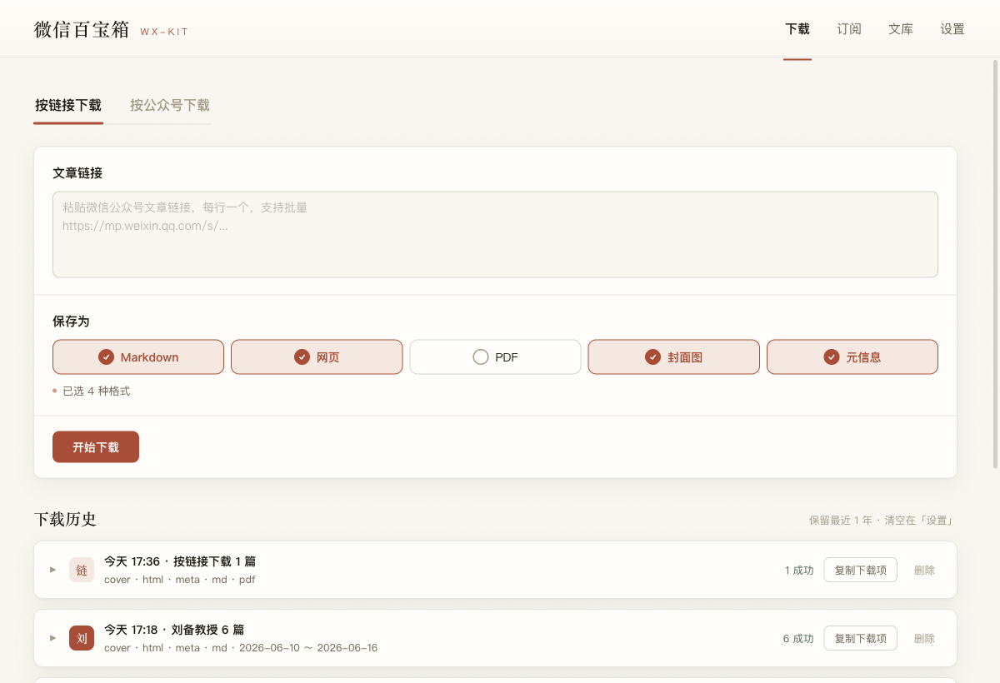
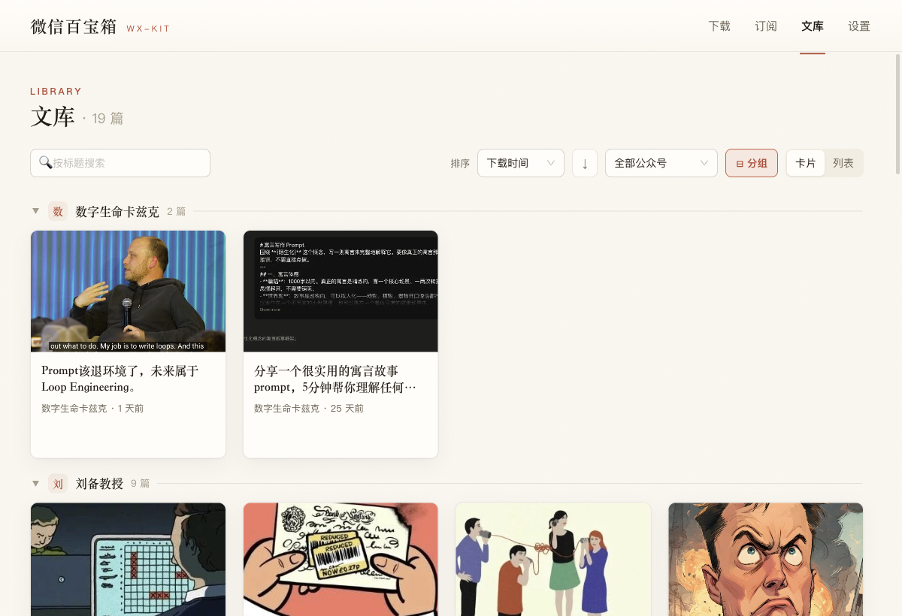
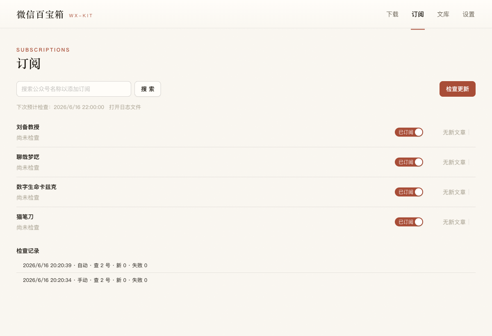

<!--
公众号长文 · 「数字生命卡兹克」风格 · 介绍 wx-kit 项目
配图说明：
- 真实截图：docs/devlog/assets/ 下的 shot-*.png，用真实 userData 启动 v0.3.0 打包前构建截取。
- AI 生成图：用 [图片：占位符] 标注，紧随其后给出生成提示词（统一画风：暖色编辑杂志 + 胶片质感）。
  发布前请按提示词生成图片替换占位符。
-->

# 收藏夹里的好文章会消失，所以我跟 AI 一起写了个工具把它们捞出来

事情是这样的。

前段时间我想重读一篇收藏过的公众号文章。挺好的一篇，当时看完拍大腿那种。点进去。

404。

「该内容已被发布者删除」。

[图片：GEN-1 开头情绪图]

> **AI 生成提示词（GEN-1）**：一个人独自坐在昏暗房间里，面对发光的电脑屏幕，屏幕上只有一个灰色的空白页面和一行小字「该内容已被删除」。暖色调，孤独感，电影感光影，从背后侧后方拍摄，人物剪影，胶片颗粒质感，编辑杂志风格。--ar 16:9
> EN: A lone person sitting in a dim warm-lit room facing a glowing computer screen showing only a grey empty page with a small line of text, sense of quiet loss and solitude, cinematic side-back lighting, silhouette, film grain, muted warm tones, editorial photography style --ar 16:9

我盯着那个灰色的页面看了几秒，有种很微妙的失落。不是愤怒，就是那种，你以为攥在手里的东西，其实从来就不在你手里。

我们每天在微信里收藏文章，收藏夹塞得满满当当，心里美滋滋，觉得这些好东西都是我的了。

但它不是。

它在别人的服务器上，在一个封闭的花园里，作者删了、平台限流了、号没了，它就跟着没了。你的收藏夹只是存了个链接，链接背后那篇文章是死是活，跟你一点关系都没有。

这事儿搁以前我可能也就叹口气过去了。但那阵子我正好在干另一件特别烦的事。

我想把一批公众号文章喂给 AI，让它帮我做点分析整理。结果你猜怎么着，我只能一篇一篇点开，一篇一篇复制，粘贴到对话框里。图片还带不出来，排版全乱。搞了七八篇我就不想干了。

[图片：GEN-2 人肉搬运工]

> **AI 生成提示词（GEN-2）**：一双手疲惫地重复复制粘贴的动作，屏幕上密密麻麻堆叠着无数个文章窗口和复制粘贴的图标，凌乱、重复、令人窒息的工作流，暖黄色调带一点焦躁的橙红，扁平编辑插画风格，略带荒诞夸张。--ar 16:9
> EN: Flat editorial illustration, a pair of tired hands endlessly copy-pasting, screen overflowing with countless stacked article windows and copy-paste icons, repetitive suffocating workflow, warm amber tones with anxious orange-red accents, slightly absurd exaggeration --ar 16:9

两件烦事撞一块儿，我突然就有点上头。

凭什么啊？

凭什么我喜欢的内容，我想存下来都这么费劲？凭什么我想把它交给我的 AI 处理，还得当个人肉搬运工？

于是我就开了个项目。给它起了个名，叫 wx-kit，微信百宝箱。

说实话一开始我没想这么多，就是想挠挠自己的痒。但做着做着，我发现这个小工具背后，藏着两件我一直挺在意的事。我一会儿慢慢跟你聊。

先说它现在长啥样。

简单讲，它干一件特别朴素的事，把微信公众号文章下载到你自己的电脑上。

你丢给它一个文章链接，它把这篇文章扒下来，存成好几种格式。Markdown、网页、PDF、封面图、还有一份元信息。图片全都拉到本地，不会哪天图床挂了你这边就一片裂图。

存完之后在 app 里直接读，排版是我专门调过的，暖色的、像翻一本旧杂志那种感觉，不是网页那种冷冰冰的白。

你也可以不给单篇链接，直接搜一个公众号的名字，扫码登录之后，把它的历史文章按数量或者日期范围一批一批扒下来。

这是第一阶段。后来我又给它加了文库管理，你扒下来的文章多了得能找得到、能排序、能按公众号分组。

最近这一版还加了个我自己特别想要的功能，订阅。

对，有点像 RSS。

你订阅几个公众号，app 开着的时候会按你设的时间，每天某个点、或者每隔几个小时，自己去看看这些号有没有发新文章。发现了，要么提醒你一下让你点个下载，要么干脆直接帮你下回来。

我知道你可能想说，公众号又没有 RSS，微信把这条路堵得死死的。

是堵得死。所以我得说句实在的，这个订阅是有边界的。它只在你电脑开着、app 开着的时候才跑，没有那种 7×24 的后台服务器。你关了电脑它就歇了，下次开机会补查一次当天的。登录状态过期了它也不会偷偷装死，会在界面上明明白白告诉你「该重新登录了」。

你看上面那张图最底下，有个「检查记录」。这是我特意做的，每次它去查了没有、查了几个号、发现几篇新的，都白纸黑字记在那儿。我不想做一个你不知道它到底有没有在干活的黑盒子。

我没把它包装成一个无所不能的东西。能做到哪儿就是哪儿，做不到的我直接跟你讲。

好，产品大概就这样。但我前面说了，这工具背后有两件我更在意的事。现在聊。

第一件，这玩意儿不只是给人用的，它是给 AI 用的。

这话什么意思。

wx-kit 是一个 app，你可以开窗口点点点。但它同时也是一个命令行工具，同一个程序，你带上参数运行，它就不开窗口了，直接在命令行里干活，而且吐出来的是干干净净的 JSON。

为啥要这样？因为我想让我的 AI agent 能直接调用它。

[图片：GEN-3 人与 AI 共读同一份内容]

> **AI 生成提示词（GEN-3）**：极简概念示意图，中间是一个文件/文档图标，向左连接一个「人(眼睛)」的图标，向右连接一个「AI(芯片/机器人)」的图标，两条线对称流动，表示同一份内容既给人读也给 AI 读。暖色背景，线条干净，瑞士国际主义平面设计风格，留白充足。--ar 16:9
> EN: Minimalist concept diagram, a document icon in the center connected by two symmetric flowing lines, left to a human-eye icon, right to an AI-chip/robot icon, representing the same content readable by both human and AI, warm beige background, clean lines, Swiss international typographic style, generous whitespace --ar 16:9

你想想看这个画面。我跟我的 AI 说，把「数字生命卡兹克」最近十篇文章扒下来，整理一份选题分析给我。然后它自己去调 wx-kit，自己把文章下到本地，自己读，自己分析。我全程不用动手。

这才是我真正想要的东西。文章下载只是表面，底下那层是，我想让内容能在我自己的系统里自由流动，人能读，AI 也能读，不用我在中间当搬运工。

我一直觉得，未来这种「给 AI 用的工具」会越来越多。我们现在做的很多软件，默认的使用者是人，是一双手一双眼睛。但接下来你得开始想，如果用它的是个 AI，这工具该长什么样？

对 wx-kit 来说，答案就是，输出必须是结构化的、可预测的、机器能直接吃的。所以它的命令行永远吐 JSON，成功失败用退出码区分，进度信息和数据信息分开走。这些设计普通用户根本看不见，但它是这个产品定位的一部分。

聊到这儿插一句，这块也踩了个挺好玩的坑。

Windows 上，这个程序因为是带图形界面的，它在命令行里跑的时候，那些 JSON 死活不回显到你的控制台。你在那儿傻等，啥都看不到，以为程序崩了。后来才搞明白，Windows 的图形子系统程序就这德行，stdout 不往调用它的控制台贴，你得把输出重定向到一个文件里才看得见。

这种坑你不亲自踩一遍，打死想不到。

好，第二件事，也是我更想跟你掏心窝子聊的。

这整个东西，是我跟 AI 一起写出来的。

不是那种「我让 AI 生成一段代码我复制粘贴」的写法。是真正的结对，从头到尾。

我先跟它一起头脑风暴，把我模糊的想法捋成清楚的需求。然后写一份详细的设计文档，把「要做什么、为什么这么做、边界在哪」定下来。再把设计拆成一个一个小到不能再小的实现步骤，每一步都先写测试、再写代码、跑通、提交。做完一个功能，还要回去更新一份「复盘日志」，把这一程的决策、踩的坑、想明白的道理都记下来。

听起来是不是有点像在带一个特别靠谱但需要明确指令的实习生？

差不多就是这个感觉。

但关键在于，AI 不是来替我思考的。它最大的价值不是「生成」，是「承接」。我负责那些它给不了的东西，产品该长什么样、这个体验丝不丝滑、这个决策对用户意味着什么。它负责把我想清楚的东西，又快又稳地落地，顺便在我犯懒或者犯傻的时候提醒我。

举个最实在的例子。

这个项目最早脱胎于我之前一个技术探索的原型。那个原型为了抓微信文章，用了一种很猛的办法，在你电脑上装一个根证书，改你的系统代理，然后把微信的网络流量全部拦下来解密。

能用。但太脏了。装根证书、改系统设置，这些东西一旦出问题，或者哪天卸载不干净，是会给用户留隐患的。

所以做正式产品的时候，我跟 AI 一起拍了板，这条路废掉，绝不重新引入。宁可功能弱一点，也不能为了抓取去动用户的系统底裤。

这种决策，是我定的方向，但 AI 帮我把它变成了一条写进项目宪法的铁律，后面每次它要写相关代码，都会回来看一眼这条规矩，不会手贱。

还有个坑，特别典型，我必须讲讲。

项目打包之后，一启动就崩。

崩得莫名其妙。开发的时候好好的，一打成安装包，运行起来主程序直接挂。

查了好一阵，最后定位到一个特别刁钻的地方。我用了一个解析网页的库，这个库底层依赖另一个库，而那个底层库里藏着一行代码，要去加载一个叫 node:sqlite 的模块。问题是，我用的这个运行环境根本没有这个模块。开发模式下它是懒加载的，不碰就没事，一旦打包，它就被打了进去，启动即加载，加载即崩溃。

解法说出来就一行配置，让那个库别被打包、保持懒加载、永远别真的去碰那个模块。

但找到这一行，花了我和 AI 来回好几轮。

我讲这些坑不是为了显摆技术。我是想说，跟 AI 一起做东西，最爽的不是它帮你写了多少行代码，而是当你撞到这种鬼坑的时候，你不是一个人在那儿干瞪眼。你俩一起顺着线索往下挖，它帮你回忆细节、帮你查文档、帮你排除可能性。

那种感觉，怎么说呢，有点像两个人打一局很难的副本。

[图片：GEN-4 人与 AI 并肩作战]

> **AI 生成提示词（GEN-4）**：一个人和一个发光的 AI 形象并肩坐在电脑前，像并肩作战的搭档，屏幕上代码与思维导图交织，暖色调，有篝火般的温暖光感，信任与协作的氛围，电影海报式构图，半写实插画。--ar 16:9
> EN: A person and a glowing AI figure sitting side by side at a desk like battle companions, screen filled with intertwined code and mind-maps, warm campfire-like glow, atmosphere of trust and collaboration, cinematic poster composition, semi-realistic illustration --ar 16:9

我用 AI 写代码这一年多，最深的一个体会是，它把「一个人也能做出一个完整产品」这件事，变成了真的。

以前你想做个像样的桌面应用，前端后端打包测试分发，每一样都是一道坎，一个人很容易就累趴在半路。现在不一样了。我不是说它让你不用懂，恰恰相反，你得比以前更清楚自己要什么，因为你得给它指方向。但那些把你拖垮的、重复的、琐碎的体力活，它能扛走一大半。

你负责想，它负责扛。

这事儿我越想越觉得有意思。

回到最开始那个 404 的页面。

我后来想明白了，我那一下的失落，根上不是因为丢了一篇文章。是因为我突然意识到，在这些封闭的平台里，我们这些用户其实是没有根的。我们以为自己在「拥有」，收藏、点赞、关注，攒了一屋子。但这些东西的开关，从来不在我们手里。

平台说删就删，说限流就限流，说这个号不存在了，那它就真的，从你的世界里消失了。

我做 wx-kit，往大了说，就是想要回那么一点点的掌控感。

我喜欢的文章，我要能真正存在我自己的硬盘上，是一个个实实在在的文件，不依赖任何人的服务器还活着。我想读它，随时能读。我想让 AI 帮我处理它，随时能处理。它是我的，是真的我的。

这点东西不大，但对我来说挺重要的。

我把它开源了，Apache 协议，扔在 GitHub 上，搜 wx-kit 就能找到。代码全在那儿，你想自己改、自己编，随便。

我得提前说清楚，它还很糙。没做苹果的签名公证，所以 mac 上第一次打开会被系统拦一下，你得去系统设置里手动点「仍要打开」。Windows 那边的命令行也有我前面说的那个坑。它是一个我用业余时间、跟 AI 一起一版一版磨出来的小东西，远谈不上完美。

但它能跑，它解决了我自己的真问题，而且它每一行代码、每一个决策的来龙去脉，都明明白白写在文档里。

如果你也常常觉得，收藏夹里那些好东西攥得不踏实，如果你也想试试让 AI 帮你打理你存下来的内容，那你可以去玩玩看。

如果你是个开发者，对「一个人怎么跟 AI 一起做出一个完整产品」这件事好奇，那项目里那份复盘日志，可能比代码本身更值得你翻一翻。我把每一程的弯路都记下来了，没藏着掖着。

我一直信一件事，好的内容、好的工具，都应该尽量自由地流动，而不是被锁在某一个花园的高墙里。

[图片：GEN-5 磨开围墙的缺口]

> **AI 生成提示词（GEN-5）**：一堵高墙上有一道被磨开的小缺口，缺口里透出温暖的光，一个小小的人形剪影正从缺口往外走，墙外是开阔明亮的世界。象征打破信息围墙。暖色调，极简，富有诗意和希望感，大量留白。--ar 16:9
> EN: A tall wall with a small worn-through gap glowing with warm light, a tiny human silhouette stepping through the gap toward an open bright world beyond, symbolizing breaking down information walls, minimalist, poetic and hopeful, warm tones, generous negative space --ar 16:9

我们能做的，就是一点一点，磨平这些信息之间的墙。

哪怕一次只磨平一点点。

以上，既然看到这里了，如果觉得不错，随手点个赞、在看、转发三连吧，如果想第一时间收到推送，也可以给我个星标⭐～

谢谢你看我的文章，我们，下次再见。

> / 作者：卡兹克
> / 投稿或爆料，请联系邮箱：wzglyay@virxact.com
